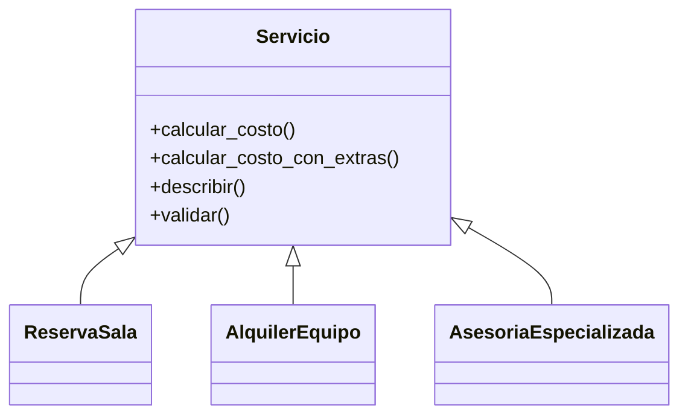

# Sistema Integral de Gestión de Clientes, Servicios y Reservas

## Descripción
Sistema orientado a objetos desarrollado en Python para la gestión
de servicios, reservas y alquileres de Software FJ.

El proyecto implementa principios fundamentales de programación
orientada a objetos como herencia, encapsulamiento,
abstracción y polimorfismo.

---

## Características
- Gestión de reservas
- Gestión de alquiler de equipos
- Asesorías especializadas
- Validaciones robustas
- Excepciones personalizadas
- Logging del sistema
- Catálogo de servicios

---

## Tecnologías utilizadas
- Python 3
- Programación Orientada a Objetos
- GitHub

---

## Estructura del proyecto

```text
├── entidades.py
├── excepciones.py
├── logger.py
├── main.py
├── reservas.py
├── servicios.py
```

---

## Diagrama UML



---

## Ejemplo de uso

```python
from servicios import ReservaSala

sala = ReservaSala(
    nombre="Sala Premium",
    descripcion="Sala equipada para reuniones",
    precio_base_hora=50000,
    aforo=20
)

resultado = sala.calcular_costo_con_extras(
    horas=5,
    descuento=10,
    personas=15
)

print(resultado)
```

---

## Conceptos POO aplicados

### Encapsulamiento
Uso de atributos privados y propiedades.

### Herencia
Las clases especializadas heredan de la clase abstracta Servicio.

### Polimorfismo
Cada servicio implementa su propia lógica de cálculo y descripción.

### Abstracción
Uso de métodos abstractos mediante abstractmethod.

---

## Integrantes
- Nombre 1
- Nombre 2
- Nombre 3

---

## Conclusiones
El proyecto permitió aplicar conceptos avanzados de programación
orientada a objetos mediante un sistema modular y escalable.
